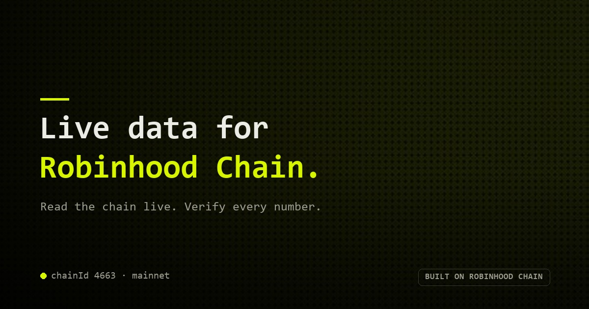

<p align="center">
  
</p>

<h1 align="center">Hood Synapse</h1>

<p align="center">
  Live data, an indexer, an API and a CLI for <b>Robinhood Chain</b>.<br>
  No key. No account. No middleman.
</p>

<p align="center">
  <a href="https://hoodsynapse.xyz">Website</a> ·
  <a href="https://hoodsynapse.xyz/docs">Docs</a> ·
  <a href="https://hoodsynapse.xyz/api">API</a> ·
  <a href="https://www.npmjs.com/package/hoodsynapse">npm</a>
</p>

---

## Try it in one line

```bash
npx hoodsynapse stats
```

```
  Robinhood Chain  ·  chainId 4663 · mainnet

  latest block       20,107,926
  block time         0.12s
  gas price          0.052024 gwei
  base fee           0.050336 gwei
  L1 anchor          25,618,941
  txs in block       12
```

## What this is

Robinhood Chain is fast and new, and the tooling around it is thin. Hood Synapse fills
that gap with three things:

- **A clean HTTP API** over the chain — decimal numbers instead of hex, ISO timestamps,
  ArbOS system transactions identified and counted separately. Open CORS, no key.
- **Our own index** — an RPC only answers for the present. We keep a database of the
  chain so history and daily statistics exist at all.
- **A CLI** — the same data from your terminal, including a chart.

Every number is verifiable against the chain. Nothing here asks for trust.

## API

Base: `https://hoodsynapse.xyz/api`

| Endpoint | Returns |
| --- | --- |
| `GET /api` | endpoint index |
| `GET /api/stats` | chain snapshot — block, gas, block time |
| `GET /api/gas` | gas breakdown |
| `GET /api/block/latest` | latest block, cleaned |
| `GET /api/block/{n}` | any block by decimal number |
| `GET /api/history` | historical blocks from our index |
| `GET /api/daily` | daily chain statistics |
| `GET /api/index-status` | how far the index reaches |

```bash
curl https://hoodsynapse.xyz/api/daily?days=30
```

## CLI

```bash
npx hoodsynapse stats            # chain snapshot
npx hoodsynapse gas              # gas breakdown
npx hoodsynapse block 20061111   # one block, orbit fields decoded
npx hoodsynapse blocks           # recent indexed blocks
npx hoodsynapse daily            # activity chart in your terminal
npx hoodsynapse status           # what the index holds
```

Add `--json` to any command to pipe into `jq`.

## How the index works

Robinhood Chain produces roughly **10 blocks per second** (~864k per day), and the public
RPC rate-limits sustained bulk reads. Indexing every block is not workable at that rate, so
the indexer **samples every 100th block** and rolls those samples into daily aggregates.

That means daily statistics are accurate and representative, while per-block history is a
sample rather than a complete archive. `GET /api/index-status` always reports exactly what
the index holds — check it against the chain any time.

## Network

| | |
| --- | --- |
| Chain ID | `4663` (`0x1237`) |
| RPC | `https://rpc.mainnet.chain.robinhood.com` |
| Explorer | `https://robinhoodchain.blockscout.com` |
| Gas token | ETH |
| Stack | Arbitrum Orbit (Nitro), settles to Ethereum |

## Repository layout

```
api/                serverless functions (the HTTP API + indexer)
  _lib.js           RPC helpers, response shaping
  _db.js            database pool
  cron/             the indexer
db/schema.sql       tables and the daily rollup
assets/             brand assets
index.html          landing page
docs.html           developer reference
```

## Running it yourself

The API needs one environment variable:

```
DATABASE_URL=postgresql://...
```

Apply `db/schema.sql` to that database, then deploy. The indexer is a plain HTTP endpoint
(`/api/cron`) — hit it on a schedule and it walks the chain forward.

---

Hood Synapse is an independent project. Not affiliated with, endorsed by, or sponsored by
Robinhood Markets, Inc.

MIT
